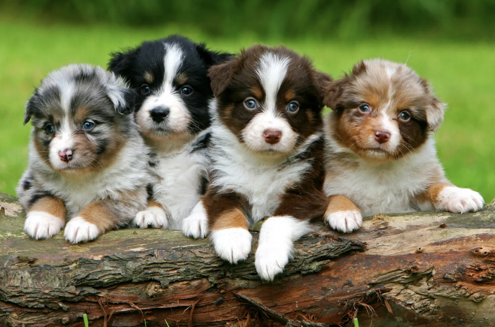

This is a manuscript to show that I have learned to:

- Use markup language(s)
- Use figures
- Use tables
- Use equations
- Reference
- Make a document with clear presentation and consistency

# Dog Intelligence
I will demonstrate my reproducible markup skills by using dog intelligence as an example, using data from @beautiful_best_2026.

I can use code that is not shown in the rendered document, by including `echo = FALSE`, like this:


    See the qmd file for the code that is hidden in the rendered document


```{r, echo = FALSE, message=FALSE}
# Load required packages
library(readxl)
library(readr)
library(tidyverse)
library(dplyr)
library(knitr)
library(kableExtra)
```

Or I can choose to use code that is shown in the rendered document, like this:

```{r, message=F}
# Load data
# make sure only relative paths are used to ensure reproducibility!
DogInt <- read_csv("data/dog_intelligence.csv") 
BreedInf <- read_csv("data/AKC Breed Info.csv")
DogCateg <-  read_excel("data/DOG_categories.xlsx")

# Join the datasets based on breed
DogData <- left_join(DogInt, BreedInf, by = "Breed")
DogData <- left_join(DogData, DogCateg, by = "Breed")

# Remove double index variable
DogData <- DogData %>% dplyr::select(-index.y)
```

## Table
As a measure of dog intelligence, I will look at the amount of repetitions they need before obeying. The more repetitions are needed, the less intelligent a dog is. Because the dataset contains an enormous amount of dog breeds, with `r length(unique(DogData$Breed))` different breeds, I decided to only look at dog categories, which contains `r length(unique(DogData$Category))` different categories. 

Some descriptive statistics about the repetitions needed before obeying a command, per category, can be found in the table below:

```{r, echo = F}
# Create new data frame to calculate mean repetions per category
DogSummary <- DogData |>
  group_by(Category) |>
  summarise(mean_lower_rep = mean(reps_lower),
            mean_upper_rep = mean(reps_upper), 
            mean_total_rep = (mean_lower_rep + mean_upper_rep)/2)

# Use kable to make a nicer-looking table
kable(
  DogSummary,
  col.names = c("Category", 
                "Mean Lower Reps", 
                "Mean Upper Reps", 
                "Mean Reps"),
  align = c("l", "c", "c", "c"),
  caption = "Repetitions of Command Needed Before Obeying Per Dog Category"
) |>
  kable_styling(
    full_width = FALSE,
    position = "center"
  ) |>
   footnote(
    general = "\\\\small{Reps = repetitions; 
    lower = least nr. of reps before obeying; 
    upper = highest nr. of reps before obeying}",
    general_title = "",
    escape = FALSE)
```

## Figure
To show I can make a figure, I will plot dog intelligence as a function of dog category.

```{r}
# The lowest number of repetitions before a dog understands the command
ggplot(data = DogData, 
       aes(x = Category, 
                    y = reps_lower, 
                    fill = Category)) + 
  geom_boxplot() +
  theme_minimal()  + 
  theme(
    # remove legend
    legend.position = "none",
    
    # create label that is presented in a slight angle to increase readability 
    axis.text.x = element_text(angle = 30, hjust = 1)
  ) +
  labs(x = "Dog Category", 
       y = "Least Number of Repetitions Before Obeying")
```

```{r, echo = F}
# The highest number of repetitions before a dog understands the command
ggplot(DogData, aes(x = Category, 
                    y = reps_upper, 
                    fill = Category)) + 
  geom_boxplot() +
  theme_minimal() + 
theme(
    # remove legend
    legend.position = "none",
    
    # create label that is presented in a slight angle to increase readability 
    axis.text.x = element_text(angle = 30, hjust = 1)
  ) +
  labs(x = "Dog Category", 
       y = "Highest Number of Repetitions Before Obeying")
```

It is clear that herding and sporting dogs need the lowest number of repetitions, while on average hounds need the most repetition.

## Equations
Hypothetically, we could say that dog intelligence per category ($I_{category}$) can be calculated as a function of the mean number of repetitions needed before obeying, as shown in Equation 1.

$$
I_{\text{category}} = \frac{1}{1 + Rep_{\text{category}}}
\tag{1}
$$

In Equation 1, $Rep_{\text{category}}$ is the mean number of repetitions needed per category.

If we want a more complex (hypothetical!) model for dog intelligence per category ($I_{category}$), we could even include learning speed ($Speed_{category}$) and some constants ($\alpha$), as shown in Equation 2. 

$$
I_{\text{category}} =
\alpha \cdot \frac{1}{1 + Rep_{\text{category}}}
+ (1 - \alpha) \cdot Speed_{\text{category}}
\tag{2}
$$

## Sourcing scripts
These equations can be implemented in a separate R script, and ran in this manuscript, by sourcing the R script `intelligence_eq1.R`, giving:

```{r}
#| file: "scripts/intelligence_eq1.R"
#| eval: true 
```

With this code, we can calculate the intelligence per category (using Eq.1) using the `DogSummary` dataset, `intelligence(DogSummary$mean_total_rep)`, giving:
`r intelligence(DogSummary$mean_total_rep)`.


This shows that herding dogs are indeed most intelligent, based on the number of repetitions they need before obeying a command.

## Images of the smartest dogs
Not only the smartest, they might also be the cutest [@noauthor_dog_2026]:



For a very nice overview of more data on different dog breeds, see [this website](https://informationisbeautiful.net/visualizations/best-in-show-whats-the-top-data-dog/) [@beautiful_best_2026].


# References
